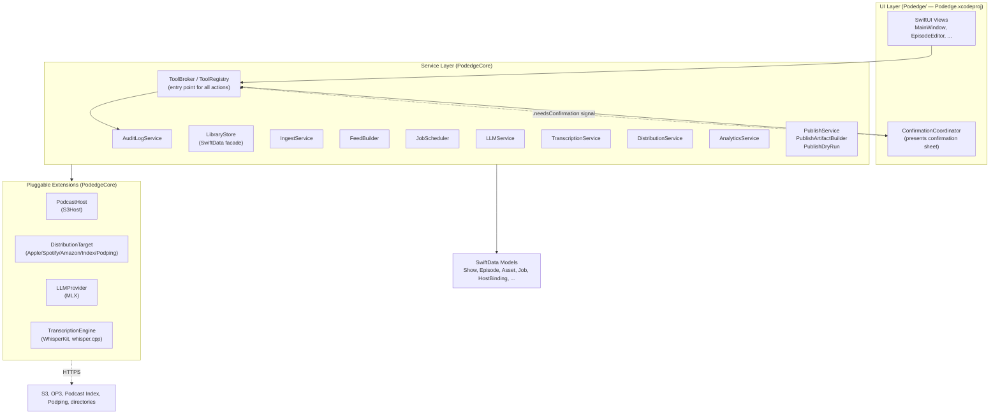
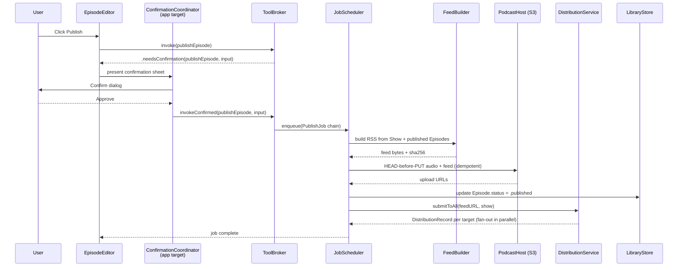

# Mental Model

> The whole of Podedge in under 5 minutes.
> **Audience:** the lead developer re-anchoring, or a contributor who has read [`onboarding.md`](onboarding.md).

<!--
Changelog
- 2026-05-01: Initial draft. Based on PodedgeCore source + .kiro/idea/podedge-technical-design.md.
- 2026-05-01: Confirmed ConfirmationCoordinator lives in the app target, not PodedgeCore. ToolBroker returns .needsConfirmation as a data signal.
- 2026-05-01: Collapsed Action Layer into Service Layer — ToolBroker, ToolRegistry, and AuditLogService are services in PodedgeCore/Services/, not a separate layer.
- 2026-05-01: Confirmed publish flow is sequential — upload completes before distribution fan-out. PublishService not yet implemented; based on technical design §6.
- 2026-05-01: WS7 complete. PublishService, PublishArtifactBuilder, PublishDryRun, and SocialBlurbRenderer now exist. Removed forward-looking caveat from publish flow section.
- 2026-05-01: WS8 complete. UI layer now exists in Podedge/ (23 files). Updated subgraph label and added ConfirmationCoordinator to diagram.
- 2026-05-01: Xcode project created. App builds and runs. Removed "planned" language from UI subgraph.
-->

## One-sentence summary

Podedge is a macOS app that turns a dropped MP3 into a published podcast episode by running a chain of durable jobs against pluggable local and remote services, with every destructive action routed through a single broker and confirmed by the user.

## The five tenets

1. **`PodedgeCore` is pure.** The Swift package holds all domain, service, and protocol code. It does not import SwiftUI or AppKit. This is enforced by `make check-core-imports`. The same core is reusable by CLI and MCP server targets later.
2. **Every action is a tool.** All user-facing actions (create show, ingest episode, publish, refresh analytics) are defined as `ToolDefinition`s and invoked through `ToolBroker`. The UI and the future assistant call the same tools the same way.
3. **Destructive actions require confirmation.** `ToolBroker` returns `.needsConfirmation(toolName:input:)` for destructive tools (publish, delete, unpublish) instead of executing them. The app-layer `ConfirmationCoordinator` presents the confirmation sheet and, on approval, calls `invokeConfirmed(toolNamed:input:caller:)`. The broker lives in `PodedgeCore`; the coordinator lives in the app target — this split keeps `PodedgeCore` free of SwiftUI.
4. **Capabilities are protocols.** `PodcastHost`, `LLMProvider`, `TranscriptionEngine`, `AudioPipeline`, `DistributionTarget`, `AnalyticsProvider`, `PromotionRenderer`. Adding a new backend means writing a new conformer, not modifying existing code.
5. **Work is durable jobs.** Long-running work (ingest, transcription, upload, distribution, analytics refresh) is enqueued in `JobScheduler`, which is SwiftData-backed and resumes across restarts.

## The picture

*Shows the enforced dependency direction: the UI depends on the Service Layer, which depends on Models and Extensions. `ConfirmationCoordinator` lives in the app target (it presents SwiftUI) and is driven by a data signal from `ToolBroker` — this keeps `PodedgeCore` free of SwiftUI.*

## Canonical flow: publishing an episode

*The sequence that ties the five tenets together. `PublishService` orchestrates the pipeline; `PublishArtifactBuilder` decides whether to use the original MP3 or a tag-rewritten copy. Distribution runs after the feed is uploaded — `DistributionTarget.submit(feedURL:show:)` requires the feed to be live at that URL. The fan-out across distribution targets happens in parallel via `DistributionService.submitToAll`, which uses a `TaskGroup` internally. `PublishDryRun` can produce the same plan without side-effects for user review before committing.*

## Invariants that must never break

| # | Invariant | Enforced by |
|---|---|---|
| 1 | `PodedgeCore` does not import SwiftUI or AppKit | `make check-core-imports` |
| 2 | All credentials live in Keychain | `KeychainService` is the only credential store |
| 3 | Every destructive action is confirmed | `ToolBroker` + `ConfirmationCoordinator` |
| 4 | All persistence goes through `LibraryStore` | Code review |
| 5 | Long-running work is a `Job`, not a loose `Task` | Code review |
| 6 | S3 uploads are idempotent (sha256-keyed HEAD-before-PUT) | `S3Host` |

## If you remember only three things

1. **UI → ToolBroker → Service → Model.** Arrows never reverse. The broker is the one-way valve.
2. **New capability? New protocol conformer.** Don't modify existing services; write a new `PodcastHost`, `DistributionTarget`, or `LLMProvider`.
3. **Nothing persistent happens outside a Job.** If it takes more than a few hundred milliseconds or has to survive a restart, it belongs in `JobScheduler`.

---

*Earlier drafts of this page flagged three open questions about `ConfirmationCoordinator`'s location, the Action Layer grouping, and the publish flow's ordering. All three were resolved by inspection of the code and the technical design document; see the changelog at the top of this file.*
