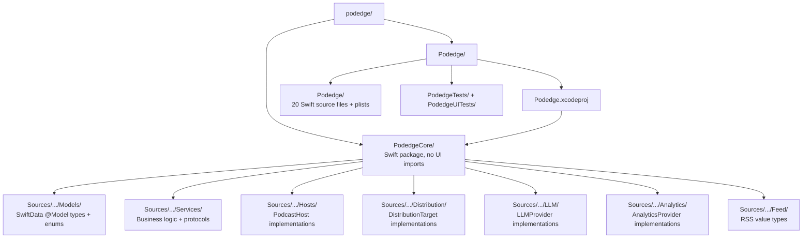

# Onboarding

> Day-1 guide for a developer joining Podedge.
> **Audience:** new contributor. **Prerequisite read:** none.

<!--
Changelog
- 2026-05-01: Initial draft. Reflects PodedgeCore state only; the app target has not yet landed in the repo.
- 2026-05-01: Confirmed OvercastTarget stub as first-change task — guided targets are ~32-line copy-paste-adapt pattern with matching ~10-line tests (verified in Distribution/ and DistributionServiceTests.swift).
- 2026-05-01: WS7 complete. PublishService, PublishArtifactBuilder, PublishDryRun, and SocialBlurbRenderer now exist in PodedgeCore.
- 2026-05-01: WS8 complete. Podedge/ app target now exists (23 files). Requires Xcode project to compile; PodedgeCore still builds via `swift build`.
- 2026-05-01: Xcode project created at Podedge/Podedge.xcodeproj. App builds and runs. Updated build instructions and project layout diagram.
-->

## What Podedge is (in one paragraph)

Podedge is a local-first macOS podcast publishing app for Apple Silicon (macOS 15+). It ingests MP3s, generates metadata with local LLMs, transcribes episodes, builds RSS feeds, uploads to object storage, and fans out to directories (Apple Podcasts, Spotify, Amazon Music, Podcast Index) and analytics (OP3). The full design lives in [`.kiro/idea/podedge-technical-design.md`](../../.kiro/idea/podedge-technical-design.md).

## Prerequisites

| Tool | Minimum | Check |
|---|---|---|
| Apple Silicon Mac | M1+ | `uname -m` → `arm64` |
| macOS | 15.0 | `sw_vers --productVersion` |
| Xcode | 16.0 | `xcodebuild -version` |
| Swift | 6.x | `swift --version` |
| SwiftLint | latest | `brew install swiftlint` |

The full prerequisite list with optional tools (Ollama, LocalStack, swift-format) is in [`CONTRIBUTING.md`](../../CONTRIBUTING.md).

## Clone and build

```bash
git clone https://github.com/rjourdan/podedge.git
cd podedge
```

### Running the app in Xcode

1. **Open the project** — double-click `Podedge/Podedge.xcodeproj` in Finder, or from Terminal:
   ```bash
   open Podedge/Podedge.xcodeproj
   ```
2. **Wait for package resolution** — Xcode automatically finds the `PodedgeCore` local package dependency. You'll see a "Resolving packages…" spinner in the status bar. This takes a few seconds on first open.
3. **Select the scheme** — In the toolbar (top-left, next to the ▶ play button), make sure it says **Podedge > My Mac**. If it shows something else, click it and select **Podedge** from the dropdown.
4. **Build and run** — Press **⌘R** (or click the ▶ button). The first build takes ~1 minute to compile PodedgeCore. Subsequent builds are incremental and fast.
5. **The app launches** — On first run you'll see the onboarding flow (welcome → create show → S3 credentials → OP3 → models → done).

### Building PodedgeCore from the command line

PodedgeCore can be built and tested without Xcode:

```bash
cd PodedgeCore
swift build       # compile the package
swift test        # run all 175 tests
```

This is useful for quick iteration on services, models, and protocols without opening Xcode.

## Project layout



*`PodedgeCore` is the real codebase. The app target wraps it with SwiftUI views. `PodedgeCore` is added as a local package dependency in `Podedge.xcodeproj`.*

## The 5 files to read on day one

Read these in order. You'll have a working mental model after ~30 minutes.

1. **[`PodedgeCore/Sources/PodedgeCore/Services/ToolBroker.swift`](../../PodedgeCore/Sources/PodedgeCore/Services/ToolBroker.swift)** — every user-facing action routes through here. If you understand `ToolBroker`, you understand how the UI and the future assistant both drive the system.
2. **[`PodedgeCore/Sources/PodedgeCore/Services/LibraryStore.swift`](../../PodedgeCore/Sources/PodedgeCore/Services/LibraryStore.swift)** — the single SwiftData facade. All persistence goes through it.
3. **[`PodedgeCore/Sources/PodedgeCore/Services/JobScheduler.swift`](../../PodedgeCore/Sources/PodedgeCore/Services/JobScheduler.swift)** — durable job queue. Ingest, transcription, publish, and analytics refresh all flow through it.
4. **[`PodedgeCore/Sources/PodedgeCore/Services/PublishService.swift`](../../PodedgeCore/Sources/PodedgeCore/Services/PublishService.swift)** — the end-to-end publish pipeline (upload → feed → distribute). Reading this shows how the protocols, `JobScheduler`, `FeedBuilder`, and `DistributionService` all compose.
5. **[`PodedgeCore/Sources/PodedgeCore/Services/PodcastHost.swift`](../../PodedgeCore/Sources/PodedgeCore/Services/PodcastHost.swift)** and the sibling protocol files (`LLMProvider.swift`, `TranscriptionEngine.swift`, `DistributionTarget.swift`, `AudioPipeline.swift`) — the pluggable extension points. Reading these tells you what the system can grow into.

Then read [`mental-model.md`](mental-model.md) to cement the shape.

## Your first change: add a stub `DistributionTarget`

A realistic ~30-minute task that touches the right patterns without requiring deep knowledge.

1. Open [`PodedgeCore/Sources/PodedgeCore/Services/DistributionTarget.swift`](../../PodedgeCore/Sources/PodedgeCore/Services/DistributionTarget.swift) and read the protocol.
2. Look at [`Distribution/ApplePodcastsTarget.swift`](../../PodedgeCore/Sources/PodedgeCore/Distribution/ApplePodcastsTarget.swift) as the minimal stub pattern.
3. Add `Distribution/OvercastTarget.swift` implementing the protocol with placeholder behavior.
4. Run `swift test` from `PodedgeCore/`. Add a test in `DistributionServiceTests.swift` if your stub has observable behavior.
5. Run `make check-core-imports` from the repo root to confirm you didn't accidentally import SwiftUI or AppKit.

If you can complete this, you understand the protocol-extension pattern, the test setup, and the `PodedgeCore` purity rule.

## Where to go next

- [`mental-model.md`](mental-model.md) — the whole system in under 5 minutes.
- [`.kiro/idea/podedge-technical-design.md`](../../.kiro/idea/podedge-technical-design.md) — the canonical design document. Long but authoritative.
- [`.kiro/steering/swift-api-design-guidelines.md`](../../.kiro/steering/swift-api-design-guidelines.md) — naming and API conventions this project follows.
- [`.kiro/skills/swift-concurrency/`](../../.kiro/skills/swift-concurrency/) — concurrency skills cards. Start with `_index.md` and `actors.md`.

---
